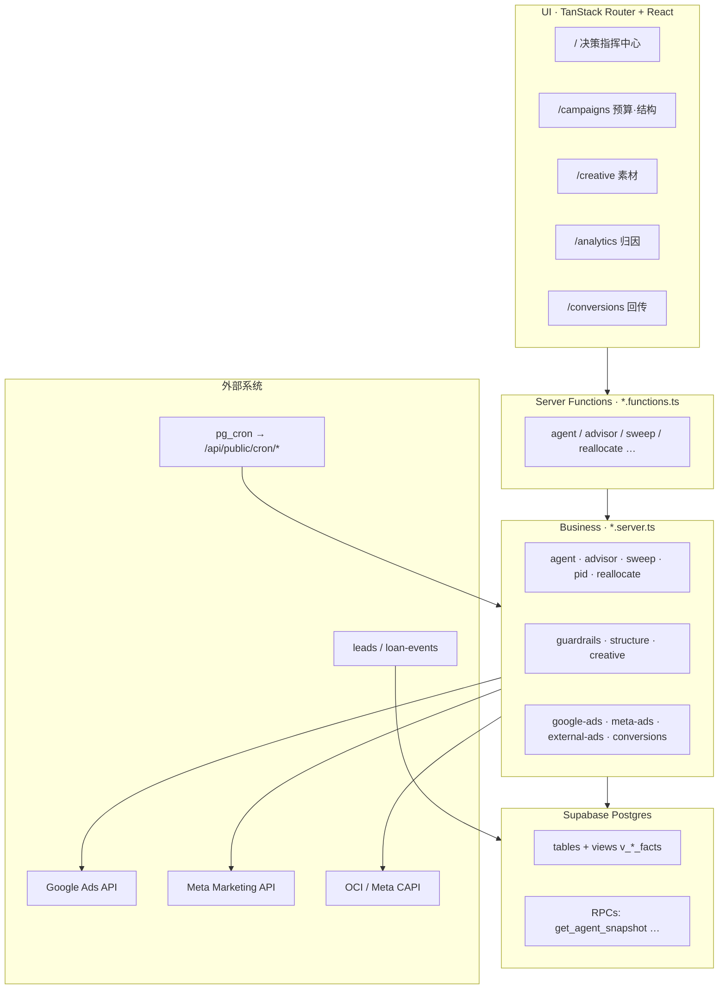
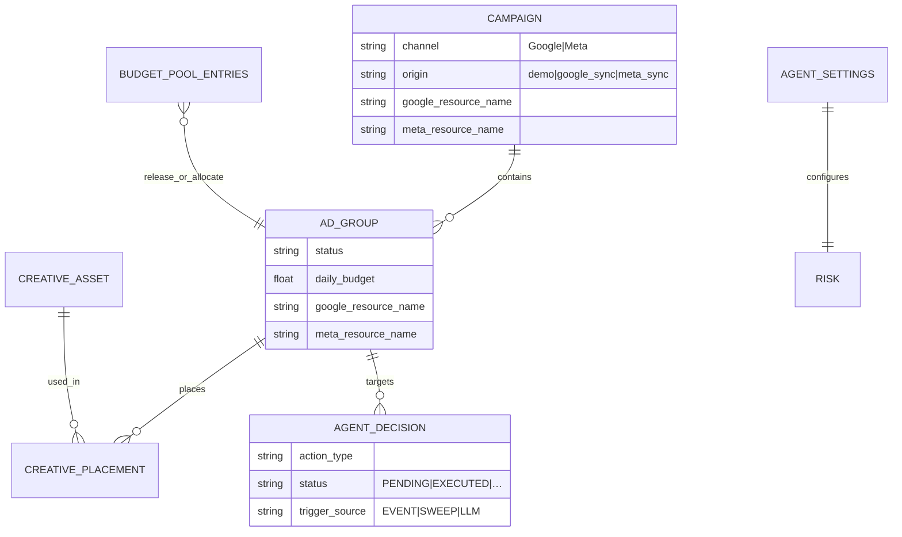
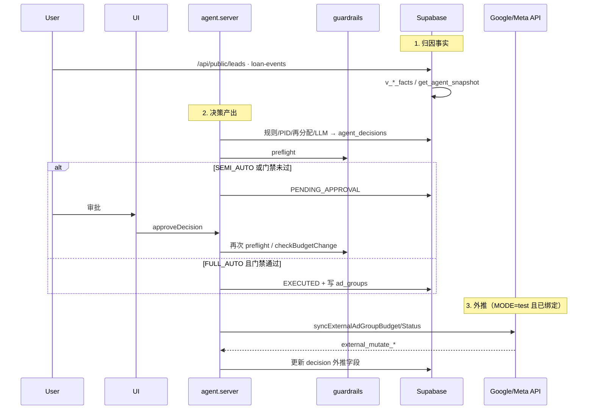
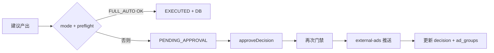
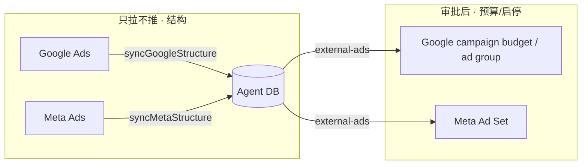
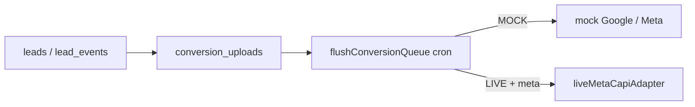

# CreditAgent 平台业务逻辑与数据流

> 维护用架构说明。配套可打印稿：[`agent-platform-overview.html`](./agent-platform-overview.html) → PDF。  
> 代码以 `src/lib/creditagent/` 与 `src/routes/` 为准；本文描述「为何这样设计」与「数据怎么走」。

**最后更新：** 2026-08-11

---

## 1. 产品定位

CreditAgent 是面向**消费信贷投放**的白盒 Agent 平台，托管 **Google Ads** 与 **Meta Ads**。

| 原则 | 说明 |
|------|------|
| 优化北极星 | 后端真实 **CPS**（成功放款成本），账户目标 CPS 硬编码为 **$19**（见 `reallocate.ts` / PID） |
| LLM 角色 | **仅分析师**：产出建议卡片，**不直接写库、不直接调 Ads API** |
| 执行权威 | 硬编码 **Guardrails** + `SEMI_AUTO` 人工审批 / `FULL_AUTO` 门禁通过后的确定性路径 |
| 结构策略 | **平台建结构 → Agent 单向镜像**；Agent 不向平台「创建系列再推回」 |

Live：https://credit-agent.lovable.app（Lovable Cloud + Supabase）。

---

## 2. 系统分层

| 层 | 路径 | 职责 |
|----|------|------|
| UI | `src/routes/*`, `src/components/creditagent/*` | 指挥中心、预算矩阵、结构树、连接面板 |
| 客户端状态 | `store.ts` | `AgentSnapshot` 缓存 + `agentApi` 变更 |
| Server Fn | `*.functions.ts` | TanStack `createServerFn` 薄封装 |
| 业务 | `*.server.ts` | 审批、扫仓、再分配、Ads、回传 |
| 纯函数 | `guardrails.ts`, `reallocate.ts`, `pid.ts`, `advisor.ts` | 可单测的规则与规划器 |
| 数据 | Supabase | 系统真相源；本地无 service role 时只读 |

---

## 3. 领域模型（执行单元）

- **Campaign**：渠道与系列级配置；可绑定平台 Campaign 资源名。
- **AdGroup**：Agent 的**执行单元**（出价、日预算、启停）。Meta 侧对应 **Ad Set**。
- **origin**：`demo` 可本地搭建；`google_sync` / `meta_sync` 为平台镜像（结构页只读倾向）。
- **AgentDecision**：动作类型含 `BUDGET_SHIFT`、`BID_ADJUST`、`CREATIVE_PAUSE` 等；状态含 `PENDING_APPROVAL` → 审批后 `EXECUTED`。
- **RiskPosture**：由 `risk_first` + `kill_switch` 推导 → `GUARDED` | `RISK_FIRST` | `KILL_SWITCH`。
- **BudgetPool**：当日闲置预算台账（`RELEASE` / `ALLOCATE`），日切不结转。

类型权威：`src/lib/creditagent/types.ts`。

---

## 4. 端到端数据流

**闭环摘要**

1. **摄入**：落地页线索 → `leads`；下游放款事件 → `lead_events`。
2. **事实**：视图算 CPL/CPS/通过率；`get_agent_snapshot()` 聚合给 UI。
3. **决策**：规则（风险/节奏/PID/再分配）与/或 LLM Advisor → `agent_decisions`。
4. **门禁**：`preflight` + 预算步长/日限额；Kill Switch 短路自动化。
5. **执行**：半自动等人批；全自动可直接写本地库。
6. **外推**：Ads `MODE=test` 且资源已绑定时推预算/状态。
7. **回传**：转化队列 → Google OCI（MOCK）/ Meta CAPI（LIVE）→ 反馈健康度。

---

## 5. 双轨控制回路

| 轨道 | 触发 | 代表逻辑 |
|------|------|----------|
| **事件驱动** | 线索/放款、UI 操作 | `autoPauseRiskyGroups("EVENT")`、`applyAiSuggestion`、手工改预算 |
| **定时扫仓** | ~15 min `POST /api/public/cron/agent-sweep` | `runAgentSweep()` |

### 5.1 `runAgentSweep` 顺序

Kill Switch 打开 → 记 `sweep_runs.skipped=KILL_SWITCH` 并返回。否则：

1. `scanFatigue` — 素材疲劳  
2. `autoPauseRiskyGroups("SWEEP")` — **仅** `RISK_FIRST`  
3. `settleExperiment` — 进行中实验结算  
4. `checkPacing` — 超投/耗尽 → 暂停 + `releaseToPool(PACING)`  
5. `runPidBudgetPass` — 朝 TARGET_CPS 的 PID **待审**预算卡  
6. `runReallocation("SWEEP")` — 闲置预算拨给高胜率组  
7. `runPlannerAdvisor("SWEEP")` — 冷却 ≥ 6h 才跑 LLM  

### 5.2 审批路径

核心入口：`approveDecision` / `rejectDecision` / `rollbackDecision`（`agent.server.ts`）。  
LLM 建议在 `advisor.server.ts`：**只插入 PENDING**，经 `sanitizeAdvice` 洗幻觉 ID 与非法动作。

---

## 6. 风控、预算池与再分配

### 风控姿态

| Posture | 行为要点 |
|---------|----------|
| `RISK_FIRST`（日常默认） | 扫仓可自动暂停 `last20ApprovalRate < 0.1` 的组并释放预算 |
| `KILL_SWITCH` | 停自动化与外推；人工操作仍记审计 |
| `GUARDED` | API 兼容；UI 主要暴露 Kill Switch |

### 预算池

- **释放**：风险暂停、节奏、低胜率等 → `budget_pool_entries.RELEASE`  
- **拨用**：`planReallocation` 筛选 ACTIVE/LEARNING、胜率 ≥ 0.22、CPS ≤ 1.1× benchmark、节奏 ≥ 0.6  
- **日切**：昨日余额 `EXPIRED`，不跨日结转  

---

## 7. 外部 Ads 与结构同步

| | Google | Meta |
|--|--------|------|
| 环境变量闸门 | `GOOGLE_ADS_MODE=off\|test` | `META_ADS_MODE=off\|test` |
| 镜像 origin | `google_sync`（`g_cmp_*`…） | `meta_sync`（`m_cmp_*`…） |
| 推送对象 | Campaign Budget + Ad Group status | **Ad Set** daily_budget + status |
| 代理 | `GOOGLE_ADS_PROXY`… | `META_ADS_PROXY` → 回退 `GOOGLE_ADS_PROXY`… |
| 统一出口 | `external-ads.server.ts`：先 Google，非 Google 再 Meta | |

结构同步**不改** `demo` 行；平台删除的行标 `platform_removed`。  
细节见 `docs/integrations/google-ads-test.md`、`meta-ads-test.md`。

---

## 8. 离线转化回传

- 设置：`ConversionSetting.mode = MOCK | LIVE`  
- 健康度进入 snapshot 的 `feedbackHealth`，提示「平台侧 CPS」与库内放款是否对齐  

---

## 9. 主要数据表与 RPC

| 表 / 对象 | 用途 |
|-----------|------|
| `campaigns` / `ad_groups` | 结构与投放配置、资源绑定、`origin` |
| `agent_decisions` | 决策日志与审批队列 |
| `agent_settings` | mode、risk、kill、门禁限额 |
| `budget_pool_entries` | 当日闲置预算台账 |
| `leads` / `lead_events` | 后端真相漏斗 |
| `conversion_*` | 回传队列与平台配置 |
| `sweep_runs` / `advisor_runs` / `guardrail_events` | 可观测性 |
| `pid_controller_state` | 组级 PID 状态 |
| `v_*_facts` | 派生指标视图 |
| `get_agent_snapshot()` | 仪表盘一次聚合 |
| `get_budget_pool_today()` | 当日池（anon 可读） |

---

## 10. 关键模块速查

| 文件 | 一句话 |
|------|--------|
| `types.ts` | 领域类型与 RiskPosture |
| `store.ts` | 前端 Snapshot + API |
| `agent.server.ts` | 快照、审批、模式/风控、暂停与预算 API |
| `advisor.server.ts` | LLM Planner → 仅 PENDING |
| `sweep.server.ts` | 15 分钟扫仓编排 |
| `guardrails.ts` + `.server.ts` | 纯规则 + preflight / 审计 |
| `reallocate.ts` + `.server.ts` | 池规划与落库 |
| `pid.ts` + `.server.ts` | CPS PID → 待审卡 |
| `structure.server.ts` | 结构 CRUD |
| `external-ads.server.ts` | 渠道无关推送路由 |
| `google-ads*.ts` / `meta-ads*.ts` | API、同步、写验收 |
| `conversions.server.ts` | 线索、队列、适配器 |
| `DecisionCard.tsx` | 审批 UI |
| `StructureTab.tsx` | 结构树与同步角标 |
| `*AdsConnectionPanel.tsx` | 探活 / 同步 / 写 QA |

---

## 11. 用户界面地图

| 路由 | 职责 |
|------|------|
| `/` | 决策指挥中心：待审队列、历史、跑 AI Analyst |
| `/campaigns?tab=budget` | 日预算矩阵、闲置池、风控、Ads 连接面板 |
| `/campaigns?tab=structure` | 系列/组/素材树；平台同步只读 |
| `/creative` | 素材库、合规、实验 |
| `/analytics` | 运营洞察 + 管理层周报 |
| `/conversions` | MOCK/LIVE 回传与队列 |
| `/api/public/cron/*` | 扫仓、转化排水 |
| `/api/public/leads` · `loan-events` | 公开摄入 |

---

## 12. 本地 vs 云端

| | Cursor 本地 | Lovable 云端 |
|--|-------------|--------------|
| 读 | `get_agent_snapshot` 等（anon + SECURITY DEFINER） | 同左 |
| 写 | 无 service role → 只读提示 | 完整写入 |
| Ads 代理 | 常需 SOCKS（`GOOGLE_ADS_PROXY`） | **不要**配代理，直连 |

---

## 13. 维护约定

1. **新自动化动作**必须走 `preflight`，并写 `agent_decisions` +（必要时）`guardrail_events`。  
2. **LLM 不得**获得写库或 Ads mutate 工具；只产出经 `sanitizeAdvice` 的 PENDING。  
3. **结构**：平台侧创建 → sync；Agent 侧只推预算/启停。  
4. **改门禁限额**走 `agent_settings`，勿在业务里硬编码第二套阈值。  
5. **集成行为变更**同步更新 `docs/integrations/*`。  

导出 PDF：见同目录 HTML 顶部说明，或 `docs/consulting/README.md` 中的 Chrome headless 命令（把路径换成本 HTML）。
